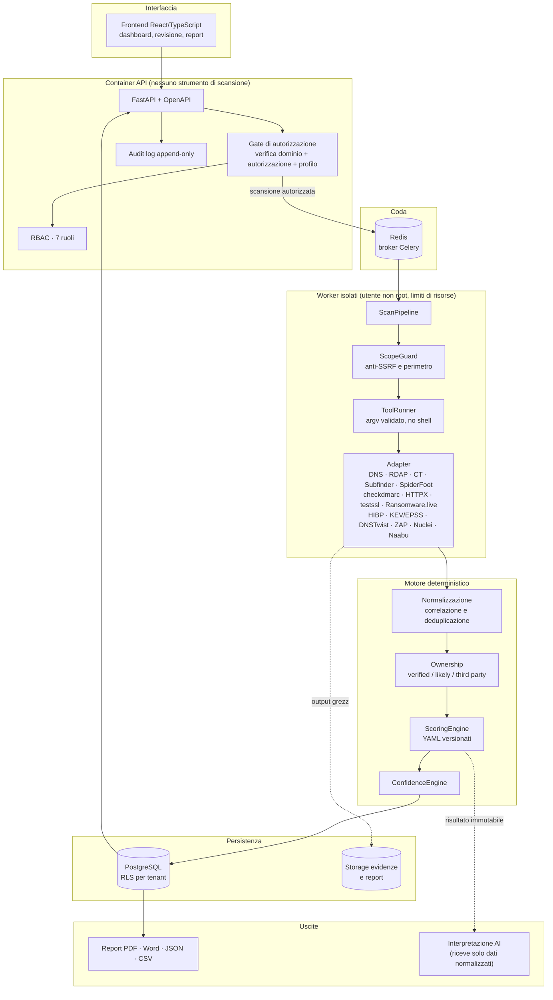
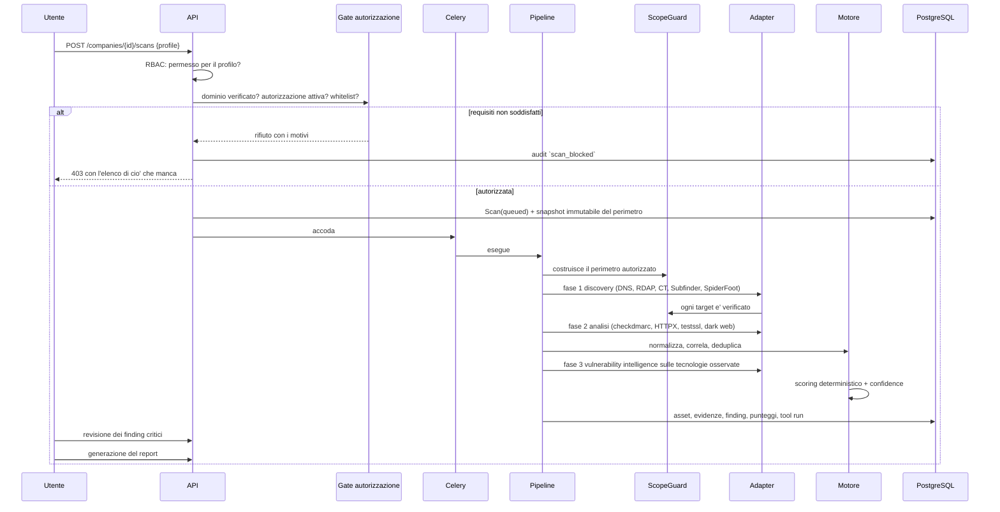
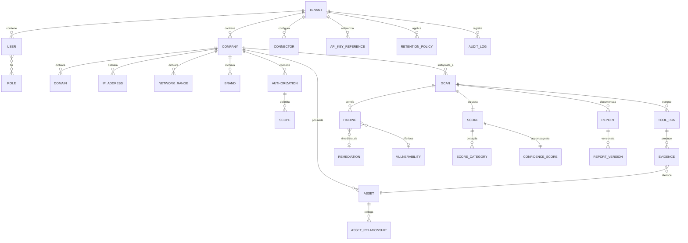

# Architettura

## 1. Principio fondante

> Gli strumenti tecnici raccolgono le evidenze.
> Il motore deterministico calcola il rating.
> L'intelligenza artificiale interpreta e spiega i risultati.

Questa separazione non e' una linea guida: e' vincolata dal codice.
Il motore di scoring (`backend/app/services/scoring.py`) non importa alcun
client di modelli linguistici e legge esclusivamente file YAML versionati.
Un modello AI, quando verra' integrato, ricevera' il risultato gia' calcolato
e potra' soltanto descriverlo.

Cio' che l'AI non puo' fare, e perche' e' strutturalmente impossibile:

| Divieto | Come e' impedito |
|---|---|
| inventare asset o evidenze | le evidenze nascono solo dagli adapter, con `fingerprint` e riferimento all'output grezzo |
| assegnare il punteggio | il punteggio e' prodotto da `ScoringEngine`, che non ha dipendenze AI |
| modificare il risultato | `Score` e' scritto dalla pipeline e non e' esposto ad alcun endpoint di modifica |
| dedurre vulnerabilita' senza prove | `adapters/vulnintel/matcher.py` richiede prodotto **e** versione compatibili |
| trattare l'assenza di risultati come sicurezza | un tool non eseguito abbassa la *confidence*, non alza il rating |
| eseguire comandi | l'esecuzione passa solo da `adapters/runner.py`, con argv validato e allowlist |
| seguire istruzioni dalle pagine analizzate | `app/core/redaction.py` neutralizza i pattern di prompt injection |

## 2. Vista d'insieme



## 3. Decisioni tecniche principali

### 3.1 Il motore di scoring e' configurazione, non codice

Pesi, regole, detrazioni, tetti e soglie vivono in `config/*.yaml` con un
numero di versione. Ogni `Score` registra la versione usata: un rating di sei
mesi fa resta spiegabile anche dopo l'evoluzione del modello. Cambiare il
modello significa modificare uno YAML ed eseguire i test di regressione, non
riscrivere Python.

### 3.2 Il fallimento di un tool non e' il fallimento della scansione

`BaseAdapter.run()` cattura ogni eccezione e la converte in un
`AdapterResult` con stato `failed` e un `coverage_impact`. La scansione
prosegue; la copertura ridotta si riflette nel confidence score. Un tool
rotto quindi **abbassa l'affidabilita' dichiarata**, non migliora il rating.

### 3.3 Un solo punto di autorizzazione dei target

Nessun adapter costruisce da se' l'elenco dei target: passa da
`ScopeGuard`, che applica in ordine formato → esclusioni → indirizzi non
pubblici → inclusioni → *default deny*. Anche i redirect vengono rivalutati
hop per hop, perche' un redirect non estende il perimetro.

### 3.4 Gli argomenti dei comandi sono dati, mai stringhe

`adapters/runner.py` non usa mai la shell. Ogni argomento e' validato contro
una regex restrittiva e ogni opzione deve comparire in un'allowlist per quel
tool: cosi' e' bloccata anche l'*argument injection* (un hostname che inizia
con `--` non puo' diventare un'opzione).

### 3.5 Il perimetro non si espande da solo

Un sottodominio che punta a CloudFront non rende CloudFront un asset del
cliente. `app/services/ownership.py` classifica CDN, cloud, hosting condivisi
e SaaS come `third_party`, con moltiplicatore 0 nello scoring.

### 3.6 La confidence e' separata dal rating

Sono due numeri con significati diversi: *quanto sei esposto* e *quanto e'
solida questa misura*. Tenerli separati evita il difetto tipico dei rating
esterni, in cui una scansione superficiale produce un buon voto.

## 4. Flusso di una scansione



## 5. Struttura del repository

```
config/           modello di scoring, profili, remediation, cap, allowlist Nuclei
backend/
  app/
    core/         configurazione, database, sicurezza, RBAC, logging, redazione
    models/       tabelle del motore; quelle con dati di cliente
                  portano tenant_id e sono protette da RLS
    schemas/      contratti Pydantic dell'API
    api/          dipendenze e router REST
    services/     scope guard, ownership, normalizzazione, scoring, confidence,
                  autorizzazione, verifica dominio, revisione, remediation, diff
    workers/      Celery e orchestratore della pipeline
    moduli/       contesti applicativi costruiti SOPRA il motore (sezione 8)
      conformita/ framework, requisiti, controlli, stato per azienda
  alembic/        migrazioni (RLS, trigger di immutabilita' dell'audit)
adapters/         un modulo per strumento, piu' runner sicuro e registro
reporting/        contesto, template Jinja2, generatori PDF/Word/JSON/CSV
frontend/         React + TypeScript + Vite
tests/            794 test: scoring, sicurezza, adapter, API, report, pipeline
docs/             questa documentazione
```

## 6. Modello dati



Note sul modello:

- **`tenant_id` ovunque.** Ogni tabella del dominio lo porta, con policy
  PostgreSQL RLS oltre ai filtri applicativi.
- **`APIKeyReference` non contiene chiavi.** Solo metadati per rotazione e
  audit; il valore vive nel secret manager.
- **`Evidence` e' immutabile,** `Finding` no: il finding e' l'unita' che
  l'analista rivede, l'evidenza e' il fatto osservato.
- **`AuditLog` e' append-only** con hash a catena, e in PostgreSQL con
  trigger che rifiuta UPDATE e DELETE.

## 7. Perche' i worker sono separati dall'API

Gli strumenti di scansione elaborano contenuti non attendibili provenienti da
Internet. Tenerli nel container API significherebbe che una vulnerabilita' in
un parser esporrebbe direttamente credenziali del database, segreti JWT e
storage delle evidenze.

Il container API non contiene alcun binario di scansione. Il worker gira come
utente non root, con `cap_drop: ALL`, filesystem temporaneo dedicato e limiti
espliciti di CPU e memoria. La sola capability aggiunta e' `NET_RAW`, e serve
unicamente al SYN scan di Naabu nel profilo esteso: chi non usa quel profilo
puo' rimuoverla.

## 8. Un repository, due prodotti

Il motore di rating si vende da solo come **Defenix Security Rating**, e sopra
di esso crescono moduli che si vendono separatamente: conformita' e NIS2
Starter oggi, TPRM domani. Stanno nello stesso repository, e la ragione e'
pratica: questo codice contiene correzioni costate care — la collisione del
binario `httpx`, il parser di `testssl`, la contabilita' della copertura — e
774 test che le tengono ferme. In due copie ogni correzione andrebbe applicata
due volte, e le basi divergerebbero in poche settimane.

Perche' «stesso repository» non diventi «stessa cosa», vale una regola:

> I moduli importano dal motore. Il motore non importa mai dai moduli.

Il motore e' `app/core`, `app/models`, `app/services`, `app/api`,
`app/schemas`, `app/workers`, piu' `adapters/` e `reporting/`. I moduli stanno
sotto `app/moduli/`. La regola non e' affidata alla memoria: la verifica
`tests/test_confini_moduli.py`, leggendo gli import di ogni file sorgente.

Due punti conoscono legittimamente entrambe le meta', e nessuno dei due e'
codice di prodotto: `alembic/env.py`, perche' le migrazioni devono vedere
tutte le tabelle, e `tests/conftest.py`, per la stessa ragione. Da qui la
scelta di tenere due registri di modelli separati — `app/models/__init__.py`
per il motore, `app/moduli/__init__.py` per i moduli — invece di un registro
unico che avrebbe rotto la regola alla prima riga.

### La conformita' e' un fondamento, non un modulo fra gli altri

`app/moduli/conformita/` non e' il modulo NIS2: e' la struttura su cui NIS2
Starter e TPRM si appoggiano entrambi. Il modello tiene separati i **requisiti**
(che appartengono a un framework e ne parlano la lingua: «art. 21, comma 2,
lettera d») dai **controlli** (cio' che l'organizzazione fa davvero, che non
appartiene ad alcun framework), e li collega con una relazione molti-a-molti.

E' li' che vive la proprieta' che conta: *un controllo implementato una volta
vale ovunque si applichi*. Aggiungere DORA significa aggiungere i suoi
requisiti in `config/framework_*.yaml` e collegarli ai controlli esistenti,
non scrivere un modulo nuovo. La struttura alternativa — una lista di spunte
per normativa — sembra piu' semplice il primo giorno e si paga a ogni
direttiva successiva.

Il catalogo sta in configurazione, come il modello di scoring: e' contenuto,
si corregge in una revisione leggibile. Le tabelle ne sono il riflesso, e
servono perche' lo stato *per azienda* abbia un aggancio e perche' «quali
controlli coprono l'articolo 21 lettera d, e come stanno sui miei quaranta
fornitori» sia una join.

### Cio' che la scansione puo' dire da sola, e cio' che non puo'

`conformita/valutazione.py` deduce lo stato dei controlli dai rilievi gia'
raccolti, e applica al risultato la stessa disciplina del rating: **l'assenza
di rilievi non e' prova di conformita'**. Un controllo senza rilievi contrari
risulta implementato solo se gli strumenti che coprono quell'area hanno
davvero girato, e con evidenza *dedotta*, non confermata; altrimenti resta
«non valutato». E' la distinzione che un cruscotto disonesto colorerebbe di
verde.

Dei 18 controlli del catalogo attuale, 12 sono osservabili dall'esterno e 6
no: quei sei sono la ragione per cui serve il questionario, e vanno mostrati
come non valutati invece che taciuti. Quando il questionario arrivera', la
stessa funzione confrontera' il dichiarato con l'osservato: dove i due
divergono, la contraddizione e' essa stessa un risultato — ed e' cio' che una
piattaforma fatta di soli questionari non puo' produrre.

## 9. Evoluzione prevista

| Fase | Contenuto | Stato |
|---|---|---|
| 1 – MVP | passivo, scoring, confidence, report, revisione | completata |
| 2 – Extended | Amass, ZAP, Naabu/Nuclei, DNSTwist, header e-mail, trend, retest, webhook | adapter e gate presenti, integrazione da completare |
| 3 – Threat Intelligence | AIL, OpenCTI/MISP, monitoraggio continuo, SIEM e ticketing | interfacce predisposte |

L'interpretazione AI si innesta a valle del motore: riceve il JSON gia'
normalizzato e sanitizzato e produce testo descrittivo. Non ha accesso agli
output grezzi ne' alla possibilita' di modificare punteggi.
