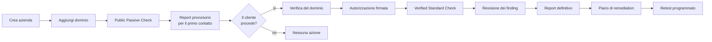

# Runbook operativo

Procedure per chi conduce le valutazioni e per chi gestisce la piattaforma.

## 1. Nuova azienda: dal contatto al report



### 1.1 Pre-sales (senza autorizzazione)

1. creare l'azienda con ragione sociale e dominio principale;
2. avviare un **Public Passive Check**;
3. attendere il completamento (dashboard → Scansioni);
4. generare un report **non definitivo** (`is_final: false`);
5. presentare il risultato **dichiarando la confidence**.

Se la confidence e' sotto il 50%, il report riporta «Valutazione provvisoria».
Non presentarlo come rating definitivo: e' scorretto e indebolisce la
credibilita' del servizio.

### 1.2 Valutazione autorizzata

1. verificare il dominio (DNS TXT o file HTTP);
2. registrare l'autorizzazione con soggetto autorizzante, perimetro, profili
   concessi, scadenza ed esclusioni;
3. registrare gli IP e le reti autorizzate;
4. controllare l'anteprima: `GET /companies/{id}/scans/authorization-preview`;
5. avviare il **Verified Standard Check**;
6. rivedere tutti i finding critici e alti;
7. generare il report definitivo (`is_final: true`);
8. far approvare il report da un Reviewer.

## 2. Revisione dei finding

Un report definitivo **non e' emettibile** finche' restano finding critici o
alti non validati. E' una scelta deliberata: un rilievo automatico che
azzera il rating di un cliente deve essere guardato da una persona.

| Azione | Quando usarla | Motivazione |
|---|---|---|
| Conferma | il rilievo e' reale | non richiesta |
| Falso positivo | il rilievo non sussiste | **obbligatoria** |
| Accetta il rischio | reale ma accettato dal cliente | **obbligatoria** |
| Escludi dal rating | reale ma fuori perimetro | **obbligatoria** |
| Richiedi retest | da verificare dopo la correzione | non richiesta |

Ogni azione e' registrata nell'audit log con stato precedente e successivo.

### Cosa guardare in un finding critico

1. l'asset e' davvero del cliente? (`ownership_status`)
2. l'evidenza e' confermata o probabile?
3. per una CVE: la versione e' nota e nel range vulnerabile?
4. per un rilievo dark web: la corrispondenza del nome e' forte?
5. il rilievo attiva un rating cap? in tal caso la validazione ha effetto
   diretto sul punteggio finale.

## 3. Diagnostica

### Scansione ferma in `queued`

```bash
docker compose ps worker
docker compose logs --tail=100 worker
docker compose exec redis redis-cli ping
docker compose restart worker
```

Se l'accodamento fallisce, l'API registra `scan_enqueue_failed` e la scansione
resta `queued`: nessun dato viene perso, basta rilanciarla.

### Un tool fallisce sempre

Il fallimento e' registrato in `ToolRun` con il messaggio d'errore. Verificare
che il binario sia presente nel worker:

```bash
docker compose exec worker which subfinder httpx testssl.sh
```

Un tool mancante produce `skipped`, non `failed`, e riduce la confidence: e'
il comportamento previsto, non un guasto.

### Confidence inaspettatamente bassa

`GET /scans/{id}/score` restituisce i singoli fattori con il rispettivo
contributo e le penalita' applicate. Cause tipiche: dominio non verificato
(−15), tool falliti, poche fonti disponibili, evidenze datate, finding critici
non ancora validati.

### Rating peggiorato senza cambiamenti evidenti

Confrontare con la scansione precedente:
`GET /scans/{id}/comparison`. Cause frequenti: nuova CVE entrata in CISA KEV,
certificato in scadenza, nuovo sottodominio esposto, pubblicazione ransomware
recente.

## 4. Manutenzione periodica

| Frequenza | Attivita' |
|---|---|
| Giornaliera | verifica dei backup, controllo dei tool falliti |
| Settimanale | autorizzazioni in scadenza, scansioni bloccate |
| Mensile | verifica di un ripristino, revisione dell'integrita' dell'audit, aggiornamento delle immagini |
| Trimestrale | revisione del modello di scoring, rotazione delle API key, revisione degli accessi |

```bash
# Integrita' della catena di audit
curl -H "Authorization: Bearer $TOKEN" \
     http://localhost:8000/api/v1/audit/integrity

# Autorizzazioni in scadenza nei prossimi 30 giorni
curl -H "Authorization: Bearer $TOKEN" \
     http://localhost:8000/api/v1/companies/$ID/authorizations
```

## 5. Incidenti

### Scansione su un target non autorizzato

1. fermare immediatamente i worker: `docker compose stop worker`;
2. estrarre dall'audit log le scansioni interessate;
3. verificare quali target sono stati effettivamente contattati (`ToolRun`);
4. informare il responsabile e, se necessario, il soggetto coinvolto;
5. correggere il perimetro prima di riavviare.

Il gate di autorizzazione e lo ScopeGuard rendono improbabile questo scenario;
se accade, indica un errore nella dichiarazione del perimetro.

### Sospetto accesso non autorizzato alla piattaforma

1. revocare le sessioni dall'identity provider;
2. estrarre gli eventi `login` e `login_failed` dall'audit;
3. verificare l'integrita' della catena di audit;
4. ruotare `JWT_SECRET_KEY` e le API key dei connettori;
5. verificare i download di report (`read_sensitive`).

## 6. Interpretare un rating con il cliente

**Quando il rating e' basso.** Concentrarsi sui rilievi confermati con
remediation a basso sforzo: gli interventi rapidi mostrano progresso reale
alla scansione successiva. Non presentare l'elenco completo dei rilievi
informativi: genera rumore e nasconde le priorita'.

**Quando il rating e' alto.** Ricordare che la valutazione e' esterna: un
rating A non dice nulla sulla sicurezza interna, sulla gestione degli accessi
o sulla resilienza dei backup. E' un buon momento per proporre una valutazione
piu' approfondita, dichiarandone la differenza.

**Quando la confidence e' bassa.** E' un'informazione, non un difetto: indica
che serve la verifica del dominio o un profilo piu' completo per ottenere una
misura affidabile.
