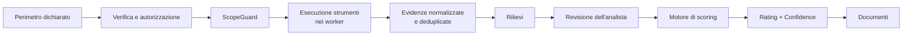

# Defenix Security Rating — documento di progetto

Documento maestro: che cos'e' la piattaforma, come e' fatta, che cosa
garantisce e dove va. E' il punto di partenza per chi entra nel progetto e il
riferimento per chi deve decidere. I documenti specialistici in `docs/`
approfondiscono i singoli temi e restano la fonte di dettaglio; dove i due
divergono, vale il documento specialistico.

Tutti i numeri di questo documento sono contati sul repository alla versione
indicata in `VERSION`, non stimati a memoria.

---

## 1. In una pagina

Defenix Security Rating osserva un'organizzazione **dall'esterno**, come la
vedrebbe un estraneo prima di qualsiasi contatto, e ne ricava un punteggio
0-100 con classe A-E. Raccoglie evidenze da 28 strumenti, le normalizza, le
correla e le passa a un motore deterministico che applica 61 regole scritte in
configurazione. Produce due documenti: un rapporto per la direzione, scritto
in italiano corrente, e un allegato tecnico con le evidenze puntuali.

Tre scelte lo distinguono dai prodotti equivalenti:

* **il punteggio e' spiegabile.** Le regole, i pesi e i tetti massimi stanno
  in file di configurazione versionati, non in un modello opaco. A ogni
  detrazione corrisponde una regola citabile e un'evidenza;
* **l'affidabilita' e' un numero separato.** Una scansione superficiale che
  non trova nulla non produce un buon voto: produce un voto *provvisorio*,
  perche' l'indice di affidabilita' resta basso. E' il difetto tipico dei
  rating esterni, ed e' evitato per costruzione;
* **l'autorizzazione e' un presupposto, non un modulo.** Esiste un solo punto
  nel codice da cui un bersaglio puo' essere raggiunto, e non lascia passare
  cio' che non e' stato autorizzato per iscritto.

Sopra il motore crescono moduli che si vendono separatamente — conformita' e
NIS2 Starter oggi, gestione del rischio di terze parti in seguito — nello
stesso repository ma con un confine verificato da un test.

---

## 2. Che cos'e', e che cosa non e'

**E'** una valutazione della sicurezza osservabile dall'esterno e dei rischi a
cui l'organizzazione potrebbe essere esposta, riferita al perimetro dichiarato
e allo stato osservato alla data della rilevazione.

**Non e'** un penetration test, non e' un vulnerability assessment completo e
non e' una certificazione di sicurezza. L'assenza di risultati non e' prova di
sicurezza. La limitazione compare nell'interfaccia e in ogni documento
generato, e non e' una formula di cortesia: e' la conseguenza del metodo, e il
documento la spiega al lettore invece di nasconderla in fondo.

Dettaglio in [`LEGAL_AND_SCOPE.md`](LEGAL_AND_SCOPE.md).

---

## 3. Il principio che regge tutto

```
gli strumenti raccolgono le evidenze
il motore deterministico calcola il rating
l'intelligenza artificiale interpreta e spiega
```

L'AI non modifica mai un punteggio. Riceve il risultato gia' normalizzato e
sanitizzato e produce testo descrittivo; non ha accesso agli output grezzi
degli strumenti. La ragione e' che un rating che cambia perche' un modello ha
cambiato idea non e' difendibile davanti a un cliente che lo contesta — e i
clienti lo contestano.

Il corollario operativo e' che **ogni contenuto raccolto da Internet e' non
attendibile**: pagine, banner, record DNS, contenuti di leak. Non viene mai
interpretato come istruzione, e gli argomenti dei comandi esterni sono
passati come vettori, mai concatenati in una stringa di shell.

---

## 4. Due prodotti, un repository

Il motore si vende da solo come **Defenix Security Rating**. I moduli —
`conformita`, NIS2 Starter, e in prospettiva il TPRM — gli crescono sopra in
`backend/app/moduli/`.

Stanno insieme per una ragione pratica: questo codice contiene correzioni
costate care, e 794 test che le tengono ferme. In due repository ogni
correzione andrebbe applicata due volte, e le basi divergerebbero in poche
settimane.

Perche' «stesso repository» non diventi «stessa cosa» vale una regola:

> I moduli importano dal motore. Il motore non importa mai dai moduli.

Non e' affidata alla memoria: `tests/test_confini_moduli.py` la verifica
leggendo gli import di ogni file sorgente. Conoscono legittimamente entrambe
le meta' solo `alembic/env.py` e `tests/conftest.py`, che non sono codice di
prodotto — da qui la scelta di due registri di modelli separati.

Dettaglio in [`ARCHITECTURE.md`](ARCHITECTURE.md) sezione 8.

---

## 5. Come funziona una valutazione



1. **Il perimetro si dichiara**, non si scopre da solo. Domini, indirizzi IP e
   reti vengono inseriti e poi verificati; la scoperta automatica propone
   sottodomini e asset correlati, che restano `unverified` finche' qualcuno
   non li conferma.
2. **L'autorizzazione e' registrata** prima che qualunque strumento attivo
   parta.
3. **ScopeGuard** e' l'unico punto da cui si raggiunge un bersaglio. Verifica
   che sia nel perimetro autorizzato e rifiuta gli indirizzi non pubblici:
   e' anche la difesa contro le richieste indirizzate all'infrastruttura
   interna.
4. **Gli strumenti girano nei worker**, mai nel container dell'API, con limiti
   di tempo e di memoria. Il guasto di uno strumento non e' il guasto della
   scansione: viene registrato nella matrice di copertura e incide
   sull'affidabilita', non sul punteggio.
5. **Le evidenze sono deduplicate** su un'impronta che combina asset, tipo di
   rilievo, dettaglio e identificativo della vulnerabilita'. Lo strumento che
   l'ha prodotta e' deliberatamente escluso dall'impronta: due strumenti che
   trovano la stessa cosa non devono contarla due volte.
6. **Il motore calcola**, e il calcolo e' tracciato.

Dettaglio in [`ARCHITECTURE.md`](ARCHITECTURE.md) sezione 4.

---

## 6. Il perimetro e l'autorizzazione

E' la parte che distingue un prodotto vendibile da uno strumento da
laboratorio, ed e' anche la piu' facile da sottovalutare.

**Tre profili di scansione**, con esigenze giuridiche diverse:

| Profilo | Strumenti | Autorizzazione | Che cosa fa |
|---|---:|---|---|
| Public Passive Check | 15 | **non richiesta** | solo fonti gia' pubbliche, nessun contatto con i sistemi dell'organizzazione |
| Verified Standard Check | 21 | richiesta | aggiunge richieste HTTP/HTTPS normali, header, TLS, ZAP Baseline |
| Verified Extended Check | 25 | richiesta | aggiunge scansione delle porte controllata e Nuclei con template approvati, solo su bersagli in lista |

La distinzione non e' formale. Il profilo passivo non richiede autorizzazione
perche' non tocca nulla, e il disclaimer dei documenti lo dichiara
diversamente dagli altri due: scrivere «attivita' autorizzata» dove nessuna
autorizzazione serviva sarebbe scorretto.

**La verifica del dominio** ammette cinque metodi: record DNS TXT, file
pubblicato via HTTP, e-mail all'indirizzo amministrativo, approvazione
manuale, documento firmato. Un dominio non verificato pesa la meta' nel
calcolo; un asset di terzi pesa zero.

Dettaglio in [`SCAN_PROFILES.md`](SCAN_PROFILES.md) e
[`LEGAL_AND_SCOPE.md`](LEGAL_AND_SCOPE.md) sezione 4.

---

## 7. Le due misure

| Misura | Domanda | Scala |
|---|---|---|
| **Security Rating** | quanto e' esposta questa organizzazione? | 0-100, classe A-E |
| **Confidence Score** | quanto e' solida questa misura? | 0-100 |

### Il rating

Cinque aree pesate, 61 regole di detrazione, quattro tetti massimi.

| Area | Peso |
|---|---:|
| Vulnerabilita' tecniche | 25% |
| Attack surface e servizi esposti | 20% |
| Sicurezza dei siti web | 20% |
| Sicurezza e-mail e DNS | 20% |
| Dark web, breach e impersonificazione | 15% |

Tre moltiplicatori entrano prima della detrazione: la **classe di evidenza**
(solo le evidenze confermate pesano al 100%; quelle dedotte pesano zero), la
**proprieta' dell'asset** (solo gli asset verificati pesano al 100%) e il
**decadimento temporale**, che invecchia le detrazioni con emivite diverse per
tipo — 180 giorni per le credenziali da stealer log, 730 per una pubblicazione
ransomware — ciascuna con un pavimento sotto cui non scende.

I **tetti massimi** limitano il punteggio complessivo a prescindere dalle
aree: ransomware confermato (39), vulnerabilita' in CISA KEV su servizio
raggiungibile da Internet (49), vulnerabilita' critiche sfruttabili (54),
credenziali recenti da stealer log (59). Si applicano **esclusivamente** a
evidenze confermate, su asset verificati, validate da un analista.

### L'affidabilita'

Undici fattori che sommano a 100: verifica del dominio, autorizzazione degli
IP, completezza del perimetro, diversita' delle fonti, tasso di riuscita degli
strumenti, profondita' del profilo, precisione del fingerprinting, validazione
umana, copertura dark web, disponibilita' delle API opzionali, freschezza
delle evidenze.

**Un controllo non eseguito riduce l'affidabilita', non il rating.** Sotto il
50% non viene pubblicato un punteggio definitivo ma la dicitura *«Valutazione
provvisoria — evidenze insufficienti per un rating attendibile»*.

Dettaglio in [`SCORING_MODEL.md`](SCORING_MODEL.md).

---

## 8. Dal dato grezzo alla decisione

Le evidenze diventano **rilievi**: l'unita' su cui lavorano il motore e il
revisore. Ogni rilievo porta una classe di evidenza, uno stato di proprieta'
dell'asset, una gravita', un codice di riferimento citabile e il collegamento
al rimedio corrispondente nel catalogo.

La **revisione** e' un passaggio del flusso, non un extra: un analista
conferma, scarta come falso positivo, accetta il rischio o marca come risolto.
La quota di rilievi gravi validati da un umano e' uno degli undici fattori
dell'affidabilita', e la validazione e' condizione necessaria perche' un tetto
massimo si applichi.

Il **catalogo dei rimedi** (27 voci) tiene separata la raccomandazione tecnica
dall'offerta commerciale: nel documento compaiono in sezioni distinte, e non
si mescolano mai.

---

## 9. I documenti prodotti

Ogni scansione produce **due documenti distinti**, generati insieme e
concatenati nello stesso PDF.

**Il rapporto per la direzione** e' scritto per chi decide: copertina con il
punteggio su un quadrante che va dal rosso al verde, poi il risultato, le
cinque aree con il significato di ciascun esito, il perimetro osservato. Ogni
intervento e' una scheda che dice *che cosa manca*, *un paragone*, *che cosa
comporta* e *quanto costa sistemarlo*. Segue la scena di cio' che puo'
succedere davvero nell'area piu' esposta, e infine che cosa fare in ordine,
con la colonna «come verificare che sia fatto» e le tre domande da porre a chi
gestisce quei sistemi.

I testi divulgativi stanno in `config/narrativa_direzione.yaml`: nomi correnti
delle aree, un paragone per ciascuno dei 27 interventi, una scena per ciascuna
delle cinque aree. Si correggono senza toccare il codice, e un test verifica
che catalogo tecnico e lingua divulgativa restino allineati. **Nulla di questo
entra nel calcolo**: traduce cio' che il motore ha gia' deciso.

**L'allegato tecnico** permette di verificare il lavoro: perimetro, inventario
degli asset, copertura degli strumenti, elenco integrale dei rilievi con le
evidenze sanitizzate, piano di rimedio completo. In caso di differenze fra i
due, fa fede l'allegato.

Formati: PDF, HTML, Word, JSON, CSV. La personalizzazione per tenant copre
marchio, colore, logo, testi di apertura e chiusura, e un interruttore per la
sezione di contesto di settore.

**Che cosa non entra mai in un documento**: password, token, cookie, contenuti
integrali di leak, istruzioni di sfruttamento, payload offensivi. Gli
indirizzi e-mail sono mascherati salvo ruolo autorizzato.

---

## 10. La conformita'

`backend/app/moduli/conformita/` e' il fondamento comune di NIS2 Starter e del
futuro TPRM.

Il modello tiene separati i **requisiti**, che appartengono a un framework e
ne parlano la lingua («art. 21, comma 2, lettera d»), dai **controlli**, che
sono cio' che l'organizzazione fa davvero e non appartengono ad alcun
framework. Fra i due c'e' una relazione **molti-a-molti**, ed e' li' che vive
la proprieta' che conta: *un controllo implementato una volta vale ovunque si
applichi*. Aggiungere DORA significa aggiungere i suoi requisiti al catalogo e
collegarli ai controlli esistenti, non scrivere un modulo nuovo.

Il catalogo sta in `config/framework_nis2.yaml` e copre oggi NIS2 e l'articolo
32 del GDPR con **18 controlli, dei quali 12 osservabili dall'esterno**. Gli
altri sei — analisi dei rischi, continuita', formazione, catena di fornitura,
controllo degli accessi, verifica dell'efficacia — sono la ragione per cui
servira' il questionario, e vanno mostrati come non valutati invece che
taciuti. Il caricatore verifica ogni riferimento: un tipo di rilievo
inesistente o un requisito senza controlli non fa rumore da solo.

`valutazione.py` deduce lo stato dei controlli dai rilievi gia' raccolti, con
la disciplina del motore applicata alla conformita': **l'assenza di rilievi
non e' prova di conformita'**. Un controllo senza rilievi contrari risulta
implementato solo se gli strumenti che coprono quell'area hanno davvero
girato, e con evidenza *dedotta*, non confermata; altrimenti resta «non
valutato».

Il posto dove il dichiarato incontrera' l'osservato e' gia' aperto: dove i due
divergeranno — il fornitore dichiara il controllo implementato e la scansione
lo smentisce — la contraddizione sara' essa stessa un risultato.

---

## 11. Sicurezza della piattaforma

Vendiamo sicurezza: la piattaforma e' essa stessa un bersaglio, e il modello
di minaccia e' scritto.

* **Anti-SSRF**: un solo punto di uscita verso la rete, che rifiuta gli
  indirizzi non pubblici e non segue redirezioni fuori perimetro.
* **Esecuzione degli strumenti**: mai nel container dell'API; argomenti come
  vettori, mai concatenazione in shell; limiti di tempo e memoria.
* **Contenuti non attendibili**: tutto cio' che arriva da Internet e' dato,
  mai istruzione. I template applicano l'autoescape; il foglio di stile passa
  come `Markup` esplicito dopo la verifica del colore del tenant.
* **Isolamento multi-tenant**: filtri applicativi *e* Row Level Security su
  PostgreSQL, con il ruolo applicativo privo di `BYPASSRLS`.
* **Audit log append-only**: trigger che impediscono UPDATE e DELETE, con
  verifica di integrita' esposta via API.
* **Container**: filesystem in sola lettura sull'API — e' la ragione per cui
  il logo del tenant vive nel database e non su disco.

Dettaglio in [`SECURITY_MODEL.md`](SECURITY_MODEL.md).

---

## 12. Multi-tenancy, ruoli, dati

**Tenant** e' il cliente della piattaforma (Defenix, oppure un fornitore di
servizi gestiti che la rivende). **Company** e' l'organizzazione valutata.
Ogni tabella con dati di cliente porta `tenant_id` ed e' protetta da RLS.

**Sette ruoli**: amministratore di piattaforma, amministratore di tenant,
analista di sicurezza, revisore, responsabile commerciale, visualizzatore
cliente, revisore in sola lettura. I nomi corrispondono ai ruoli dell'identity
provider OIDC, cosi' che la mappatura sia diretta.

**Conservazione**: politiche di retention configurabili, applicate da un
processo giornaliero, con cancellazione completa su richiesta.

---

## 13. Esercizio

Venti servizi in `docker-compose.yml`, di cui quattro dietro profilo
opzionale: ZAP, Keycloak, SpiderFoot, proxy Tor.

| Comando | Cosa fa |
|---|---|
| `make install` | installazione completa |
| `make aggiorna` | ricostruisce le immagini e riavvia — da usare dopo ogni modifica |
| `make diagnosi` | stato dei servizi, versioni, salute |
| `make test` | 794 test |
| `make report-demo` | genera i documenti su dati sintetici |

I documenti dimostrativi portano una banda in testa e una filigrana su ogni
pagina: un documento su dati sintetici che non lo dichiari e' indistinguibile
da uno vero, e prima o poi qualcuno lo allega a un'offerta.

Le versioni delle immagini e degli archivi scaricati sono fissate e verificate
da `scripts/check_pinned_versions.py`.

Dettaglio in [`DEPLOYMENT.md`](DEPLOYMENT.md) e
[`OPERATIONS_RUNBOOK.md`](OPERATIONS_RUNBOOK.md).

---

## 14. Stato del progetto

| | |
|---|---|
| Codice Python, senza test | 18.553 righe |
| Test | 8.335 righe, **794 test** in 47 file |
| Frontend | 3.919 righe, 10 pagine |
| Configurazione versionata | 2.862 righe YAML |
| API | 71 endpoint, 8 router |
| Modello dati | 37 tabelle, 6 migrazioni |
| Motore | 61 regole, 5 aree, 5 classi, 4 tetti, 27 rimedi |
| Raccolta | 28 strumenti, 3 profili |
| Conformita' | 2 framework, 14 requisiti, 18 controlli |

Il motore di rating e' completo e in esercizio. Il fondamento della
conformita' e' scritto e collaudato. Tutto il resto del percorso verso un TPRM
e' davanti.

---

## 15. Dove va

| # | Blocco | Righe | Perche' in questa posizione |
|---|---|---:|---|
| 1 | Scansione ricorrente e notifiche | 1.500 | oggi si vende una fotografia, con questo un abbonamento |
| 2 | Registro fornitori e rating di filiera | 2.700 | i rating dei fornitori esistono gia': aggregarli e' vendibile subito |
| 3 | NIS2 Starter | 2.000 | le fondamenta ci sono; si vende per conto suo e paga il primo tratto del TPRM |
| 4 | Questionario e portale fornitore | 4.000 | il pezzo che fa dire «e' un TPRM» |
| 5 | Registro rischi con scadenze | 1.500 | chiude il cerchio: rilevo, chiedo, assegno, verifico |

Stima complessiva verso un TPRM completo: **circa 31.500 righe**, il
raddoppio della base attuale. Dettaglio, metodo di stima e limiti della stima
in [`ROADMAP_TPRM.md`](ROADMAP_TPRM.md).

Tre cose non si risolvono scrivendo codice, e vanno pianificate a parte: le
fonti dati a pagamento (sette dei ventotto strumenti sono oggi spenti per
questo), il pen test della piattaforma e la strada verso ISO 27001, e il
contenuto normativo dei questionari — che e' lavoro di dominio legale e vale
meta' del valore percepito.

---

## 16. Limiti dichiarati

Sono nel prodotto, non in una nota a pie' di pagina, perche' un rating che non
dichiara i propri limiti e' fuorviante per costruzione.

* L'analisi e' esterna: non sostituisce una verifica interna dei sistemi.
  L'accesso remoto, i sistemi di produzione e i backup — le tre esposizioni
  che contano di piu' in un'impresa — si valutano solo dall'interno.
* L'assenza di rilievi in un'area non e' prova di sicurezza: puo' dipendere
  dalla copertura degli strumenti, ed e' per questo che l'affidabilita' e' un
  numero separato e visibile.
* I rilievi non confermati sono indicati come tali e non incidono sul
  punteggio.
* Le fonti pubbliche e i cataloghi di vulnerabilita' possono essere incompleti
  o aggiornati con ritardo.
* Gli asset di terzi — CDN, cloud, hosting condivisi, fornitori, SaaS — sono
  esclusi dal calcolo.
* La valutazione vale alla data della rilevazione. Un'esposizione puo' nascere
  la settimana successiva.

---

## 17. Mappa dei documenti

| Documento | Contenuto |
|---|---|
| [`ARCHITECTURE.md`](ARCHITECTURE.md) | componenti, flussi, modello dati, il confine fra motore e moduli |
| [`SCORING_MODEL.md`](SCORING_MODEL.md) | regole, pesi, tetti, decadimento, affidabilita' |
| [`SCAN_PROFILES.md`](SCAN_PROFILES.md) | profili, strumenti ammessi, azioni vietate |
| [`SECURITY_MODEL.md`](SECURITY_MODEL.md) | minacce, contromisure, isolamento, audit |
| [`LEGAL_AND_SCOPE.md`](LEGAL_AND_SCOPE.md) | limiti del servizio, autorizzazioni, privacy |
| [`DEPLOYMENT.md`](DEPLOYMENT.md) | installazione, configurazione, hardening |
| [`OPERATIONS_RUNBOOK.md`](OPERATIONS_RUNBOOK.md) | esercizio, backup, incidenti, manutenzione |
| [`ROADMAP_TPRM.md`](ROADMAP_TPRM.md) | distanza da un TPRM vendibile, ordine, stima |

### Glossario minimo

**Rilievo** — un problema correlato e deduplicato, l'unita' su cui lavorano il
motore e il revisore. **Evidenza** — il dato grezzo sanitizzato da cui nasce un
rilievo. **Classe di evidenza** — quanto e' solida: confermata, probabile,
dedotta, informativa. **Proprieta'** — se l'asset e' verificato
dell'organizzazione, probabile, non verificato o di terzi. **Tetto massimo** —
condizione che limita il punteggio complessivo a prescindere dalle aree.
**Copertura** — quali strumenti hanno girato davvero, e su quali aree.
**Controllo** — cio' che l'organizzazione implementa, indipendente dalla norma.
**Requisito** — cio' che una norma chiede, nella sua lingua.
