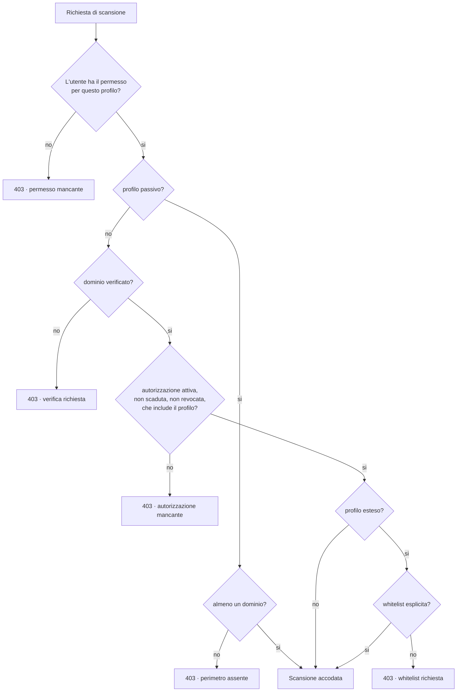

# Profili di scansione

Tre profili, con requisiti e limiti crescenti. Il profilo determina quali
strumenti possono essere eseguiti: un tool non elencato nel profilo non viene
istanziato, nemmeno se richiesto esplicitamente.

## Sintesi

| | Public Passive | Verified Standard | Verified Extended |
|---|---|---|---|
| Verifica del dominio | non richiesta | **richiesta** | **richiesta** |
| Autorizzazione formale | non richiesta | **richiesta** | **richiesta** |
| Whitelist esplicita | non richiesta | non richiesta | **richiesta** |
| Contatto diretto col target | no | HTTP/HTTPS e TLS | + porte e Nuclei |
| Strumenti disponibili | 10 | 15 | 17 |
| Uso tipico | pre-sales, prima analisi | valutazione periodica | verifica approfondita |

## 1. Public Passive Check

Utilizzabile senza alcuna autorizzazione perche' consulta esclusivamente
fonti pubbliche: non tocca l'infrastruttura del target.

**Fonti:** DNS pubblico, RDAP, Certificate Transparency, enumerazione passiva
dei sottodomini, classificazione degli indirizzi IP pubblici (reverse DNS e
rete RDAP), OSINT via SpiderFoot (solo moduli passivi), configurazione
e-mail pubblicata in DNS, leak site ransomware, fonti di data breach,
indirizzi e-mail esposti in violazioni (XposedOrNot), domini simili,
CISA KEV ed EPSS.

**Vietato:** port scanning, vulnerability scanning, brute force, crawling
aggressivo, tentativi di autenticazione, exploit, fuzzing, verifiche
intrusive.

Sull'assenza di risultati: un profilo passivo che non trova nulla produce una
confidence bassa (profondita' 0.45) e quindi, spesso, un rating provvisorio.
E' il comportamento voluto: non aver guardato non e' la stessa cosa che non
aver trovato.

## 2. Verified Standard Check

Richiede la verifica della proprieta' del dominio **e** un'autorizzazione
formale registrata che includa questo profilo.

**Aggiunge:** richieste HTTP/HTTPS normali, analisi degli header,
fingerprinting delle tecnologie, verifica dei certificati e della
configurazione TLS, OWASP ZAP Baseline, controllo STARTTLS, verifica dei
redirect, screenshot, validazione dei servizi web.

**Vietato:** port scanning, exploit, brute force, modifica di dati, fuzzing.

Su ZAP: e' ammesso **esclusivamente** ZAP Baseline. Full Scan e Active Scan
non sono attivabili da configurazione (`forbidden_modes` in
`config/tool_profiles.yaml`).

## 3. Verified Extended Check

Richiede verifica, autorizzazione **e** una whitelist esplicita di IP, domini
o URL approvati. Senza almeno una voce di perimetro attiva la scansione non
parte.

**Aggiunge:** port scanning controllato (Naabu, lista di porte predefinita,
rate limit prudenti), service discovery, Nuclei con template approvati,
validazione non invasiva delle vulnerabilita'.

**Vietato:** credential stuffing, password spraying, brute force, tentativi di
login, SQL injection attiva, denial of service, upload di file, esecuzione di
payload, modifica o cancellazione di dati, exploit distruttivi, scansione di
infrastrutture di terzi.

### Allowlist Nuclei

Nessun template viene eseguito se non e' in `config/nuclei_allowlist.yaml` con
`approved: true`. Ogni voce dichiara identificativo, versione, descrizione,
severita', tipo di richiesta, classificazione, timeout, numero massimo di
richieste e approvatore.

Sono esclusi per costruzione i template `network-raw`, `headless`, `code`,
`javascript`, `file` e `websocket`, e i tag `dos`, `fuzz`, `brute-force`,
`intrusive`, `rce`, `sqli`, `file-upload`, `default-login`, `exploit`,
`deserialization`.

### Nmap e la licenza

Naabu (MIT) e' preferito a Nmap: la Nmap Public Source License limita la
redistribuzione in prodotti commerciali. L'adapter Nmap resta previsto per
installazioni che dispongano di una licenza propria; l'alias di default punta
a Naabu.

## Il perimetro degli indirizzi IP

I domini in perimetro risolvono su indirizzi IP, e quegli indirizzi espongono
servizi. Non tutti sono pero' sondabili.

A ogni scansione, in **tutti** i profili, gli indirizzi raggiunti vengono
arricchiti con il reverse DNS e con la rete RDAP e classificati:

| Classificazione | Significato | Scansione attiva |
|---|---|---|
| Rete condivisa | edge di CDN o reverse proxy (Cloudflare, Akamai, Fastly...): risponde per molti clienti insieme | **mai**, in nessun profilo |
| Hosting | l'istanza e' del cliente, la rete e' del fornitore (AWS, Azure, OVH, Aruba...) | ammessa se autorizzata |
| Rete propria | assegnazione diretta o hosting dedicato | ammessa se autorizzata |

Gli indirizzi entrano nel perimetro come **inventario**, mai come autorizzati:
una scansione non puo' autorizzare se stessa. L'autorizzazione e' un atto
esplicito dell'analista, in *Gestione azienda → Perimetro di rete*, registrato
nel log di audit con l'identita' di chi l'ha compiuto. Il motivo non e'
formale: sondare porte su un indirizzo che non appartiene al cliente e' un
fatto di cui qualcuno deve rispondere.

Il rifiuto di autorizzare un indirizzo di CDN e' applicato dal server, non
dall'interfaccia: l'API risponde 409 anche a una richiesta costruita a mano.

Conseguenza pratica: nel profilo Extended il port scanning non parte finche'
nessun indirizzo e' autorizzato, e lo dichiara — «N indirizzi IP pubblici
individuati, nessuno coperto da un'autorizzazione esplicita» — invece di
risultare semplicemente senza rilievi.

## Gate di autorizzazione

Ogni rifiuto e' registrato nell'audit log come `scan_blocked`, con i motivi.
L'endpoint `GET /companies/{id}/scans/authorization-preview?profile=...`
restituisce lo stesso esito senza avviare nulla, cosi' l'interfaccia puo'
spiegare in anticipo cosa manca.

## Verifica della proprieta' del dominio

Quattro metodi, tutti tracciati:

| Metodo | Come funziona |
|---|---|
| `dns_txt` | record TXT temporaneo su `_defenix-verification.<dominio>` |
| `http_file` | file su `/.well-known/defenix-verification.txt`, senza seguire i redirect |
| `admin_email` | codice inviato a un indirizzo amministrativo del dominio (RFC 2142) |
| `manual_approval` | approvazione di un Platform Administrator, con riferimento del documento |

La sfida scade dopo 14 giorni e il numero di tentativi e' limitato. La
verifica HTTP non segue i redirect di proposito: un redirect potrebbe
spostare la prova su un host non controllato dall'organizzazione.

## Autorizzazione: cosa viene registrato

Come richiesto dalla sezione 4 della specifica: soggetto autorizzante e suo
ruolo, azienda, data e ora, perimetro autorizzato, profili concessi, data di
scadenza, esclusioni, riferimento al documento di autorizzazione e utente
della piattaforma che ha registrato la concessione.

Le autorizzazioni sono revocabili con motivazione obbligatoria; la revoca ha
effetto immediato sul gate.

## Limiti globali

Validi per qualunque strumento, indipendentemente dal profilo
(`global_limits` in `config/tool_profiles.yaml`):

| Limite | Valore |
|---|---|
| Target per esecuzione | 500 |
| Output massimo per tool | 50 MB |
| Durata massima | 3600 s |
| Esecuzioni concorrenti | 4 |
| Memoria per processo | 2048 MB |
| CPU per processo | 3000 s |
| Quota della directory temporanea | 512 MB |
