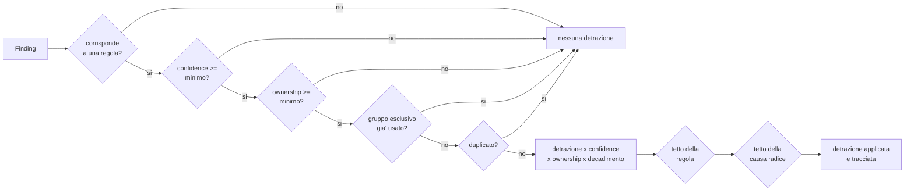

# Modello di scoring

Tutto quello che segue e' definito in `config/scoring.yaml`,
`config/rating_caps.yaml` e `config/evidence_confidence.yaml`. Questo
documento spiega il *perche'*; la configurazione resta l'unica fonte di verita'.

## 1. Le due misure

Defenix produce **due numeri distinti**, e tenerli separati e' una scelta
deliberata:

| Misura | Domanda a cui risponde | Intervallo |
|---|---|---|
| **Exposure Rating** | Quanto e' esposta questa organizzazione? | 0–100, classe A–E |
| **Confidence Score** | Quanto e' solida questa misura? | 0–100 |

Il difetto tipico dei rating esterni e' fondere le due cose: una scansione
superficiale che non trova nulla produce un buon voto. Qui una scansione
superficiale produce un rating *provvisorio*, perche' la confidence resta
bassa. Sotto il 50% non viene pubblicato alcun punteggio definitivo, ma la
dicitura:

> Valutazione provvisoria – evidenze insufficienti per un rating attendibile.

## 2. Le cinque aree

| Area | Peso | Cosa misura |
|---|---:|---|
| Attack surface e servizi esposti | 20% | quanto e' ampia e governata la superficie pubblica |
| Vulnerabilita' tecniche | 25% | vulnerabilita' note su asset raggiungibili |
| Sicurezza dei siti web | 20% | TLS, header, cookie, esposizioni applicative |
| Sicurezza e-mail e DNS | 20% | SPF, DKIM, DMARC, DNSSEC, MTA-STS, CAA |
| Dark web, breach e impersonificazione | 15% | credenziali esposte, ransomware, domini simili |

Ogni area parte da 100 e subisce detrazioni. Il punteggio complessivo e'
la somma pesata:

```
Overall = Σ (Punteggio_area × Peso_area)
```

Le vulnerabilita' tecniche pesano di piu' perche' sono l'unica area in cui
un rilievo confermato corrisponde a una via di ingresso diretta.

## 3. Come si trasforma un rilievo in detrazione



### 3.1 Moltiplicatore di confidence

| Classe | Moltiplicatore | Significato |
|---|---:|---|
| `confirmed` | 1.00 | fatto verificato (un record DNS assente e' un fatto) |
| `probable` | 0.50 | indizio forte ma non provato |
| `inferred` | 0.00 | deduzione: informa, non penalizza |
| `informational` | 0.00 | contesto |
| `false_positive`, `accepted_risk`, `resolved` | 0.00 | escluso dal calcolo |

Il punto chiave: `inferred` vale **zero**. Un prodotto rilevato senza versione
non genera mai una vulnerabilita' confermata.

### 3.2 Moltiplicatore di ownership

| Ownership | Moltiplicatore | Quando si applica |
|---|---:|---|
| `verified_owned` | 1.00 | dominio verificato o IP autorizzato |
| `likely_owned` | 0.50 | riconducibile a un dominio dichiarato ma non verificato |
| `unverified` | 0.00 | non attribuibile con certezza |
| `third_party` | 0.00 | CDN, cloud, hosting condiviso, SaaS |
| `excluded` | 0.00 | escluso esplicitamente |

Un cliente non e' penalizzato per la configurazione di CloudFront.

### 3.3 Decadimento temporale

Un breach del 2013 e uno stealer log di due mesi fa non sono lo stesso rischio.

| Profilo | Emivita | Valore minimo |
|---|---:|---:|
| `stealer_log` | 180 giorni | 40% |
| `breach_recent` | 365 giorni | 25% |
| `breach_old` | 540 giorni | 10% |
| `ransomware_post` | 730 giorni | 50% |

Il valore minimo evita che un evento grave svanisca del tutto: una
pubblicazione ransomware conserva sempre almeno meta' del proprio peso.

## 4. Le tre difese contro la doppia penalizzazione

Questa e' la parte piu' delicata del modello e usa tre meccanismi distinti.

**Deduplicazione.** Se HTTPX, ZAP e Nuclei rilevano lo stesso header mancante
sullo stesso host, il fingerprint e' identico: e' un solo finding, penalizzato
una volta. La chiave di deduplicazione e' dichiarata per regola.

**Gruppi esclusivi.** Una CVE in CISA KEV con CVSS 9.8 ed EPSS 0.97
corrisponderebbe a tre regole diverse. Le regole di severita' delle
vulnerabilita' condividono `exclusive_group: vulnerability_severity`: per uno
stesso finding si applica **solo la piu' severa** (40 punti, non 40+25+10).

**Tetti per causa radice.** Dodici siti senza HSTS sono un solo problema
organizzativo. Il gruppo `web_headers` non puo' superare 30 punti
complessivi, per quante configurazioni mancanti si trovino.

## 5. Rating cap

Alcune condizioni rendono irrilevante il resto della valutazione: se i dati
dell'azienda sono gia' pubblicati su un leak site, un buon punteggio negli
header web non e' rappresentativo.

| Condizione | Punteggio massimo |
|---|---:|
| Pubblicazione ransomware attiva e confermata (entro 730 giorni) | 39 |
| Servizio Internet-facing con vulnerabilita' in CISA KEV | 49 |
| Vulnerabilita' critica confermata sfruttabile da Internet | 54 |
| Credenziali aziendali in stealer log recenti (entro 180 giorni) | 59 |

I cap si applicano **solo** con tutte e tre queste condizioni:

1. evidenza `confirmed`;
2. asset `verified_owned`;
3. finding validato da un analista (`analyst_validation = validated`).

Un rilievo automatico non validato **non** puo' azzerare il rating di
un'azienda. Il punteggio prima del cap resta registrato in
`Score.raw_weighted_score` per trasparenza.

## 6. Classi di rating

| Classe | Intervallo | Lettura |
|---|---|---|
| A | 85–100 | esposizione contenuta |
| B | 70–84 | miglioramenti necessari |
| C | 55–69 | esposizione significativa |
| D | 40–54 | rischio elevato |
| E | 0–39 | esposizione critica |

L'assegnazione confronta **solo il limite inferiore**, scendendo dalla soglia
piu' alta. Confrontare anche il limite superiore lascerebbe scoperti i
punteggi frazionari fra due classi: 54.46 non e' ne' `<= 54` ne' `>= 55` e
ricadrebbe nella classe peggiore. Il test `test_scala_delle_classi_continua`
verifica ogni decimo da 0 a 100.

## 7. Confidence score

I pesi sommano esattamente a 100 e la base e' 0: il punteggio e' quindi la
percentuale di copertura effettivamente raggiunta. Una base positiva
saturerebbe la scala e le impedirebbe di distinguere una buona scansione da
una eccellente.

| Fattore | Peso | Cosa misura |
|---|---:|---|
| Successo degli strumenti | 16 | tool completati sul totale pianificato |
| Dominio verificato | 12 | proprieta' dimostrata |
| Completezza del perimetro | 10 | asset con ownership determinata |
| Diversita' delle fonti | 10 | fonti indipendenti interrogate |
| Profondita' del profilo | 10 | passivo 0.45 · standard 0.80 · esteso 1.00 |
| Validazione umana | 10 | finding critici/alti rivisti da un analista |
| Precisione del fingerprint | 8 | tecnologie con versione determinata |
| Anzianita' dei dati | 7 | eta' media delle evidenze |
| IP autorizzati | 6 | copertura delle autorizzazioni sugli IP |
| Copertura dark web | 6 | fonti dark web effettivamente disponibili |
| API opzionali | 5 | connettori commerciali configurati (es. HIBP) |

Penalita' esplicite: nessun dominio verificato −15, tutti i tool falliti −40,
scansione parziale −5, perimetro vuoto −40.

L'ultima merita una nota: senza alcun target gli strumenti "riescono" senza
avere nulla da analizzare. Il risultato non e' un'azienda sicura, e' una
valutazione priva di significato, e va dichiarata tale.

## 8. Modificare il modello

1. modificare lo YAML e incrementare `version`;
2. eseguire `make test` (i test di regressione dello scoring sono vincolanti);
3. documentare la motivazione nel messaggio di commit.

I punteggi storici restano interpretabili perche' ogni `Score` registra la
versione del modello con cui e' stato calcolato.

## 9. Esempio verificabile

Azienda con DMARC assente (25), SPF assente (22), spoofing possibile (15),
tutti confermati su dominio verificato. Il gruppo `email_dmarc` e' limitato a
30 e `email_spf` a 25:

```
email_dns_security = 100 − min(25+15, 30) − min(22, 25) = 100 − 30 − 22 = 48
Overall = 100×0.20 + 100×0.25 + 100×0.20 + 48×0.20 + 100×0.15 = 89.6 → classe A
```

Lo stesso caso con evidenze `probable` dimezza le detrazioni; con asset
`unverified` non produce alcuna detrazione. Entrambi i comportamenti sono
coperti da test.
