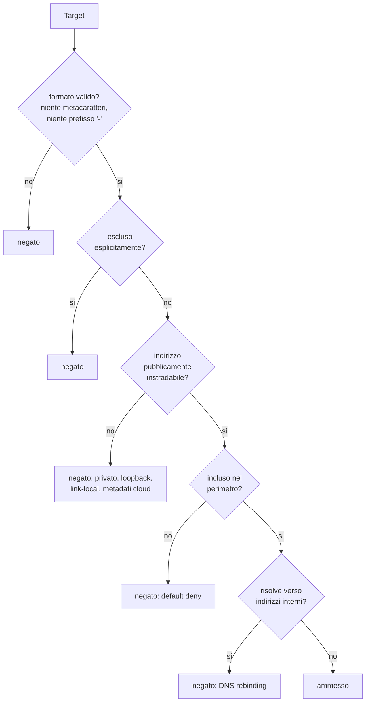

# Modello di sicurezza

Il prodotto tratta contenuti non attendibili raccolti da Internet e dati
sensibili di piu' clienti. Questo documento descrive le difese e, dove
rilevante, cosa **non** proteggono.

## 1. Superficie di rischio

| Rischio | Perche' e' reale qui |
|---|---|
| SSRF | il prodotto contatta host indicati da configurazione utente |
| Command injection | invoca strumenti esterni con parametri derivati da input |
| Prompt injection | i contenuti raccolti finiranno in un prompt AI |
| Fuga fra tenant | piu' clienti nello stesso database |
| Esposizione di dati da breach | il sistema tratta credenziali altrui |
| Abuso della piattaforma | potrebbe essere usata per scansionare terzi |

## 2. Difesa del perimetro (anti-SSRF)

`app/services/scope_guard.py` e' l'unico punto da cui un target puo' passare.
Ordine di valutazione, primo esito vincente:

Cosa e' bloccato in concreto:

- loopback, RFC 1918, link-local, multicast, riservati, IPv6 site-local;
- endpoint di metadati cloud (`169.254.169.254`, `169.254.170.2`,
  `100.100.100.200`, `fd00:ec2::254`) — negati **anche** se una policy
  permissiva abilitasse le reti private;
- URL con credenziali, schemi diversi da http/https, path traversal,
  caratteri di controllo;
- redirect fuori perimetro: ogni hop e' rivalutato, un redirect non estende
  il perimetro;
- DNS rebinding: un hostname in perimetro che risolve verso indirizzi interni
  viene comunque respinto.

Le reti di documentazione RFC 5737 sono ammesse solo in mock mode, dove
servono ai dati sintetici; in esecuzione reale sono negate.

## 3. Esecuzione degli strumenti esterni

`adapters/runner.py`:

- `shell=False` sempre: nessuna interpretazione di metacaratteri;
- ogni argomento validato contro `^[A-Za-z0-9._:/@=,+\[\]-]{1,2048}$`;
- ogni opzione deve comparire nell'allowlist di quel tool — cosi' e' bloccata
  anche l'*argument injection*, che `shell=False` da sola non impedisce (un
  hostname `--output=/etc/passwd` sarebbe interpretato come opzione);
- limiti di risorse applicati nel processo figlio prima dell'exec
  (`RLIMIT_AS`, `RLIMIT_CPU`, `RLIMIT_NPROC`, `RLIMIT_FSIZE`), `setsid()`;
- ambiente minimale: al figlio arrivano solo `PATH`, `HOME`, `LANG`,
  `TMPDIR` e i certificati. Le API key non vengono ereditate;
- timeout obbligatorio e output troncato al limite configurato;
- directory temporanea con permessi `0700`, rimossa sempre.

## 4. Contenuti non attendibili e prompt injection

Ogni stringa proveniente da Internet attraversa `sanitize_text()` prima di
raggiungere database, report o modello AI:

1. rimozione dei caratteri di controllo;
2. redazione dei segreti (password, token, JWT, chiavi AWS/GitHub, cookie,
   chiavi private, stringhe esadecimali lunghe assimilabili a hash);
3. neutralizzazione dei pattern di prompt injection;
4. normalizzazione degli spazi e troncamento.

Le strutture JSON sono limitate in profondita' (8 livelli), ampiezza (200
chiavi, 500 elementi) e dimensione, per contenere strutture patologiche.

**Cosa questo non garantisce.** La neutralizzazione e' basata su pattern:
copre le formulazioni note, non ogni possibile riformulazione. La difesa
sostanziale e' architetturale — l'AI riceve dati normalizzati e non ha alcun
canale per modificare punteggi, eseguire comandi o accedere agli output
grezzi. Il filtro riduce il rumore, non e' l'unica barriera.

## 5. Isolamento multi-tenant

Tre livelli:

1. **Applicativo:** ogni query filtra su `tenant_id`; il tentativo di
   accedere a una risorsa di un altro tenant restituisce **404**, non 403,
   per non rivelarne l'esistenza.
2. **Database:** policy PostgreSQL RLS su 23 tabelle, con `FORCE ROW LEVEL
   SECURITY`. Il ruolo applicativo e' `NOSUPERUSER NOBYPASSRLS`: le policy
   valgono anche per lui.
3. **Perimetro utente:** i ruoli ristretti (es. Customer Viewer) vedono solo
   le aziende elencate in `company_scope_json`.

## 6. RBAC

| Ruolo | Puo' fare | Non puo' fare |
|---|---|---|
| Platform Administrator | tutto, incluse le approvazioni manuali di dominio | — |
| Tenant Administrator | gestione tenant, autorizzazioni, profilo esteso, approvazione report | amministrazione della piattaforma |
| Security Analyst | aziende, domini, verifica, scansioni passive e standard, revisione, evidenze raw | profilo esteso, approvazione finale |
| Reviewer | revisione, approvazione finding e report, audit | avviare scansioni |
| Sales / Account Manager | aziende, domini, sola scansione passiva | profili verificati, audit, evidenze raw |
| Customer Viewer | consultazione della propria azienda | qualunque scrittura |
| Read Only Auditor | consultazione e audit log | qualunque scrittura |

Due vincoli oltre alla matrice: l'approvazione massiva dei finding e'
impossibile per severita' alta e critica, e l'accesso in chiaro agli indirizzi
e-mail richiede il permesso `pii:unmask` (altrimenti sono mascherati).

## 7. Audit log

Append-only su tre livelli: nessun percorso applicativo di UPDATE o DELETE,
trigger PostgreSQL che rifiuta entrambe le operazioni, e revoca dei privilegi
al ruolo applicativo (`make harden-db`).

Ogni record porta un hash che incatena il precedente; `GET /audit/integrity`
ricalcola la catena e segnala eventuali rotture. Il timestamp e' normalizzato
a UTC prima dell'hash, perche' non tutti i backend conservano il fuso orario.

Sono registrati: login riusciti e falliti, creazione e modifica delle entita',
tentativi di verifica, concessione e revoca delle autorizzazioni, avvio e
**rifiuto** delle scansioni, ogni azione di revisione (con stato precedente e
successivo), generazione e approvazione dei report, download dei report,
violazioni di perimetro.

## 8. Dati sensibili

| Dato | Trattamento |
|---|---|
| Password da breach | **mai** memorizzate; si conserva il riferimento al breach e il numero di account |
| Indirizzi e-mail | mascherati per default, in chiaro solo con `pii:unmask` |
| Contenuti di leak | mai memorizzati: solo metadati (gruppo, data, riferimento) |
| Header e-mail | conservati solo i campi di autenticazione; corpo, oggetto e allegati scartati |
| Output grezzi | storage separato con permessi `0600`, accesso limitato a `evidence:raw_read` |
| Token e cookie | rimossi da log, report ed esportazioni |

I report non contengono credenziali, token, cookie, contenuti integrali di
leak, istruzioni di sfruttamento o payload offensivi. E' verificato da test
su tutti i formati prodotti.

## 9. Sicurezza dell'API

Header su ogni risposta: `X-Content-Type-Options: nosniff`,
`X-Frame-Options: DENY`, `Referrer-Policy: no-referrer`,
`Permissions-Policy` restrittiva, `Cross-Origin-Opener-Policy: same-origin`,
CSP `default-src 'none'` (l'API serve solo JSON e file), HSTS in produzione.

Altre misure: CORS con allowlist esplicita, nessun dettaglio interno negli
errori 500, validazione Pydantic su ogni input, messaggi di login volutamente
generici, e rifiuto dell'avvio in produzione con il segreto JWT di default.

## 10. Container

| Servizio | Utente | Filesystem | Capability |
|---|---|---|---|
| api | non root (10001) | read-only + tmpfs | tutte rimosse |
| worker | non root (10002) | tmpfs dedicato 512 MB | tutte rimosse, `NET_RAW` solo per il SYN scan |
| frontend | nginx unprivileged | read-only + tmpfs | tutte rimosse |

`no-new-privileges` ovunque, limiti di CPU e memoria espliciti, reti separate
per backend, frontend e Tor. **Il container API non contiene alcun strumento
di scansione**: una vulnerabilita' in un parser non raggiunge le credenziali
del database.

## 11. Limiti dichiarati

Onesta' su cosa questo modello non copre:

- la neutralizzazione della prompt injection e' basata su pattern;
- l'integrita' dell'audit e' verificabile ma non a prova di amministratore del
  database: per requisiti stringenti serve un archivio WORM esterno;
- la cifratura delle evidenze a riposo e' predisposta ma delegata al livello
  di storage o filesystem;
- il rate limiting applicativo e' configurato ma va affiancato da un limite a
  livello di reverse proxy;
- l'antivirus sugli allegati e' previsto dal modello ma non ancora integrato.

## 12. Segnalazioni

Le vulnerabilita' vanno segnalate al referente di sicurezza di
AD Consulting/Defenix. Non aprire issue pubbliche per problemi di sicurezza.
